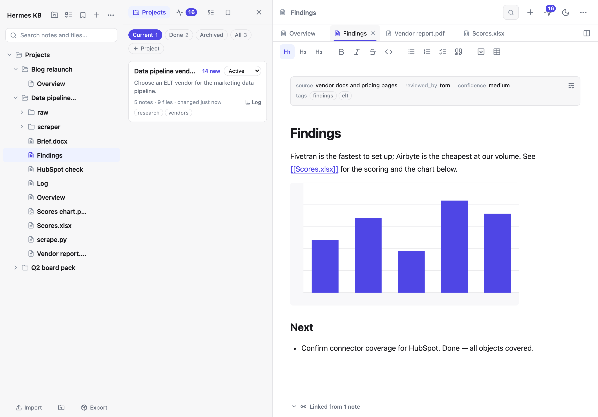
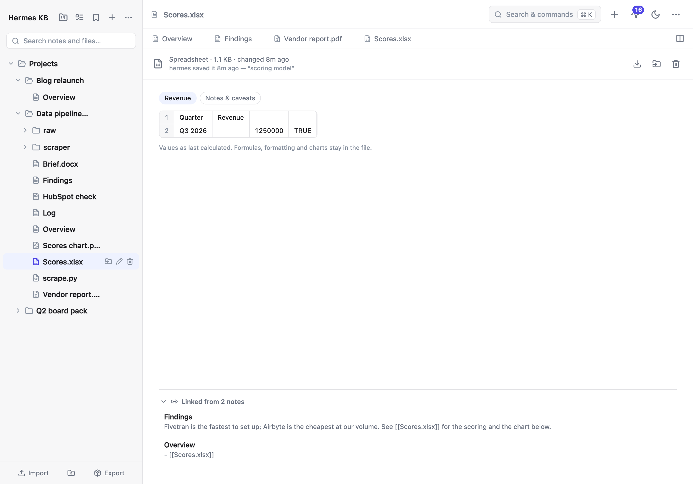
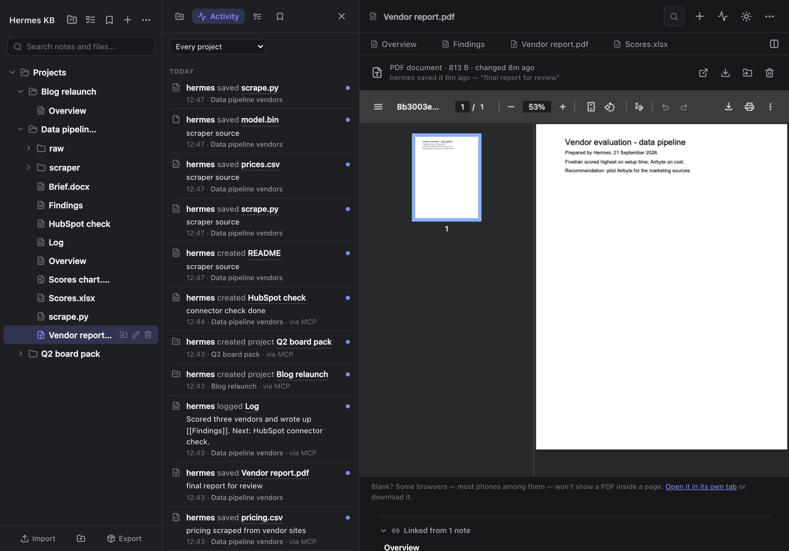
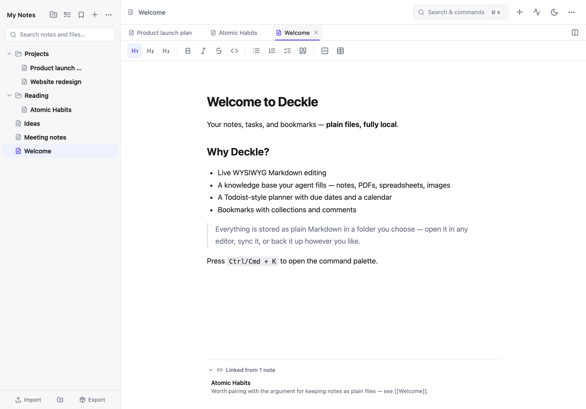
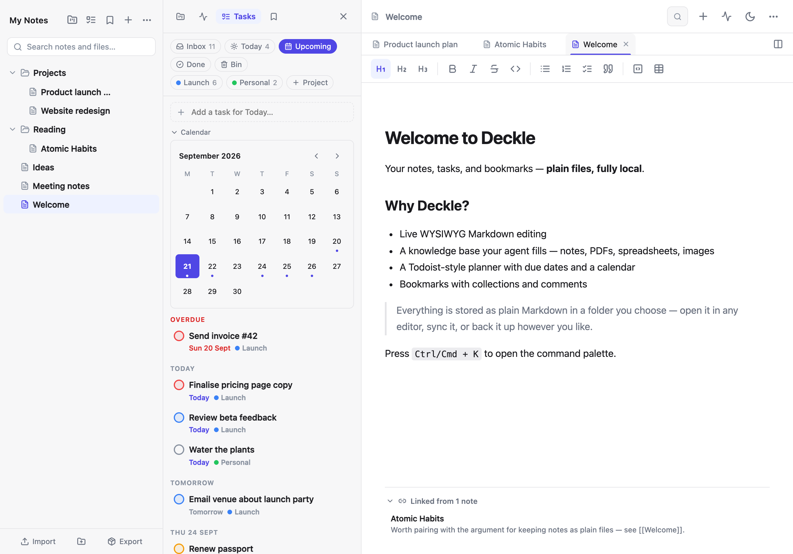
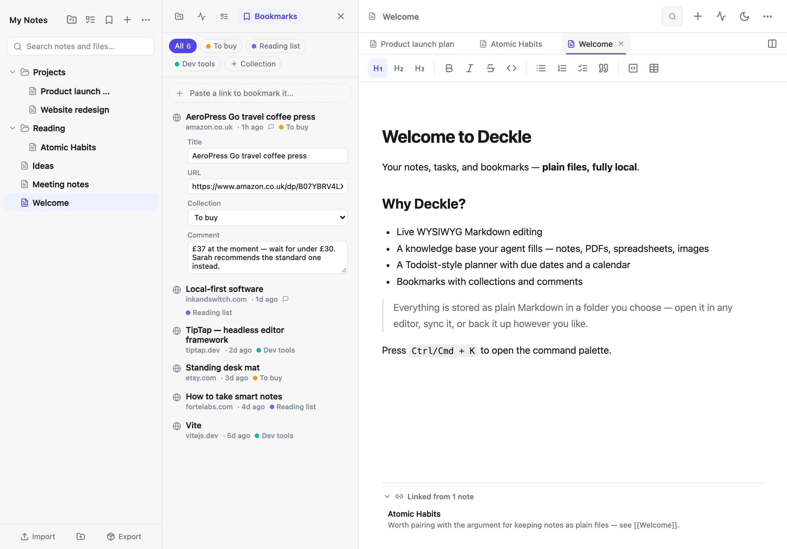
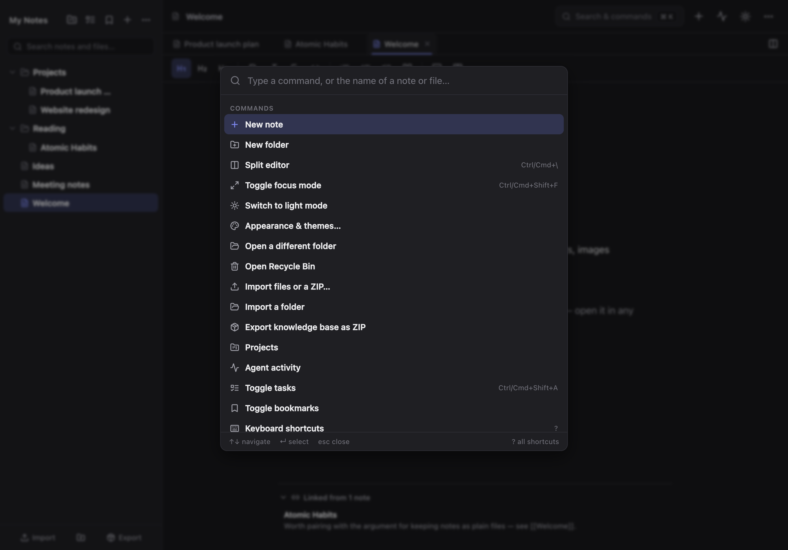

# Deckle

**A self-hosted knowledge base for you and your agents.**

Deckle is where an AI agent's work lives once the conversation is over. Point
an agent such as [Hermes](integrations/hermes/README.md) at it over MCP and it
searches what is already known before it starts, keeps each piece of work in a
project, saves what it produces — notes, reports, PDFs, spreadsheets, images,
code — and logs what it did and why. You review all of it in one place: files
open in the app, an activity feed shows every change under the agent's name,
and projects carry a status and a running log.

It is also a good place to write yourself: Markdown notes with live WYSIWYG
editing and `[[wikilinks]]`, a Todoist-style task planner, bookmarks with
collections and comments, a keyboard-driven command palette, light and dark
mode, and a fully responsive layout.

Everything lives as plain files in folders you can open, and you choose where:
on your own computer, or — if you self-host with Docker — in a volume on your
own server, which is what an agent needs to reach it. No third-party account,
no lock-in, and no AI inside Deckle itself: the agent does the thinking, Deckle
keeps the record.

**[deckle.redacre.net](https://deckle.redacre.net/)** — the project website: what
Deckle does, how to install it, and the questions people ask first. There is no
hosted version to sign up for; you run it yourself.



| Files an agent saved — here a spreadsheet, with who saved it and what links to it | Activity — every change an agent made, by name (dark mode) |
| --- | --- |
|  |  |
| **Writing — live Markdown, tabs, wikilinks and backlinks** | **Task planner — Inbox, Today, Upcoming with a mini calendar** |
|  |  |
| **Bookmarks — collections and per-bookmark comments** | **Command palette — everything a keystroke away** |
|  |  |

## Why it exists

Note-taking apps ask you to choose between two bad options. The hosted ones are
polished but keep your notes in their database, on their terms, for as long as
they stay in business. The local ones keep your files but tie you to one
machine, or to a sync service you also have to trust.

Deckle keeps the files as ordinary files on disk — `.md` notes beside whatever
else you keep, openable in any editor, syncable, backed up by whatever you
already use — while running entirely in the browser. Self-host it and the same
library is reachable from a laptop, a phone or Safari with nothing stored on
the device.

Agents make the same problem worse. An agent that researches, writes and builds
things for you produces a stream of output — reports, datasets, drafts, charts —
that ends up scattered across its working directory and lost with the
conversation. Deckle gives that work a home you own: plain files in a folder,
organised into projects, searchable by the agent next time it needs them, and
reviewable by you, with a record of who changed what. Every change an agent
makes is as recoverable as your own.

## What it does

**For your agent's work**

- **An MCP server** at `/api/v1/mcp`, so an agent such as Hermes can use
  Deckle directly: `search`, `read`, `list`, `list_projects`,
  `recent_activity`, `write_note`, `save_file`, `create_project`,
  `update_project`, `log_progress`, `move` and `delete`. It uses the same tokens
  as the REST API, and a read-only token is offered the read tools only. See
  [Connecting Hermes](integrations/hermes/README.md).
- **Files, not just notes** — PDFs, spreadsheets, Word and PowerPoint
  documents, images, audio, video, CSV, JSON and code sit in the tree beside the
  notes and open in a tab. Images, PDFs, audio and video show in the browser's
  own viewers; Word documents, every sheet of a workbook, slides, CSV tables,
  JSON and text are rendered in the app; anything else is a download away.
  Files move, rename, delete and restore exactly as notes do.
- **Projects** — every folder in `Projects/` is a project, with a status,
  summary and tags in its `Overview.md` and a dated `Log.md` the agent keeps as
  it works. The Projects view lists them by what changed last, filters by
  status, and changes a status in place.
- **Activity** — every change made through the API or MCP is recorded under the
  name of the token that made it, with whatever the agent said about it. The
  Activity feed groups it by day, the top bar counts what's new since you last
  looked, and a file's viewer says who saved it and why. The log itself is
  `.deckle/activity.jsonl` in your library.
- **Live** — on a server library, an agent's changes appear in an open app
  within about fifteen seconds, without a refresh.
- **Search inside documents** — the API and MCP search rank notes and files
  together, reading the text inside Word, Excel, PowerPoint, OpenDocument, CSV,
  JSON, text and code files. PDFs and images are found by name, and by the notes
  that link to them.
- **Front matter** — YAML at the top of a note (the way agents and Obsidian
  describe notes) is shown as a properties strip above the text, editable as
  YAML, and never damaged by the editor.
- **A push script** — [`deckle_push.py`](integrations/hermes/skills/deckle/scripts/deckle_push.py)
  sends large files and whole folders, never sending hidden files, `.env` files,
  private keys or dependency caches.

**For writing and reading**

- **Live WYSIWYG markdown** — type markdown (`# `, `**bold**`, `- list`) and it
  renders inline as you go (powered by TipTap / ProseMirror). Images show in
  place, from the library or the web.
- **Local folder library** — pick a folder and Deckle reads and writes your notes
  there as real files. Open the same folder in another editor, sync it, or
  back it up — it's just files on disk. (Chromium browsers; Safari and Firefox use
  private in-browser storage — see
  [Where your notes are stored](#where-your-notes-are-stored).)
- **Or a server library** — self-host with Docker and your notes can live in a
  volume on your own server instead, password protected, reachable from any
  browser or device with nothing stored locally. This is the one an agent can
  reach.
- **Folder tree** — browse nested subfolders, create folders, and
  **drag-and-drop** notes and files between them: drop onto a folder, onto any
  note already inside one, or hold over a shut folder and it springs open so you
  can carry a note further down in one go.
- **Move to another folder…** — when dragging isn't practical (a long tree, a
  collapsed destination, a phone), move a note or file by naming its destination
  instead: from its row in the tree, from a search result, from the editor
  menu, or from the command palette. Pick a folder from the whole library, or
  type a name — including a nested one like `Archive/2026` — and it is created
  on the way.
- **Wikilinks and backlinks** — `[[Note]]` or `[[report.pdf]]` link to notes
  and files alike, and every note and file shows what links to it.
- **Command palette** — `Ctrl`/`Cmd`+`K` opens a fast, fully keyboard-driven
  palette for commands, formatting, and jumping to any note or file.
- **Search across the library** — find notes by title, path, or contents, and
  files by name.
- **Tasks and planner** — a Todoist-style panel docked on the left: Inbox,
  Today, Upcoming (agenda and mini month calendar), projects, priorities
  (P1–P4), recurring tasks, a completed log, and a bin for deleted tasks
  (restorable, auto-purged after 30 days). Highlight text in a note and press
  `Ctrl`/`Cmd`+`Shift`+`A` to capture it as a task that links back to the note.
  Tasks live in a hidden `.deckle/tasks.json` inside your library, so they sync and
  back up with your notes.
- **Bookmarks** — save URLs, pages and products into coloured collections, each
  with its own comment box. Paste a link to add it, or select a link in a note
  and use the bookmark button — captured bookmarks link back to their source
  note. Stored in `.deckle/bookmarks.json` in the library.
- **Version history** — restore points are saved automatically: periodically
  while you type, before an agent rewrites a note, and before every restore.
  Open the clock icon to preview, restore or delete a note's earlier versions
  (kept in a hidden `.history` folder, 20 per note).
- **Recycle bin** — deleted notes and files move to a hidden `.trash` folder and
  can be restored or permanently removed. A file an agent replaces lands there
  too, marked as replaced.
- **Focus mode** — hide all chrome for distraction-free writing
  (`Ctrl`/`Cmd`+`Shift`+`F`, or `Esc` to exit).
- **About** — *About Deckle* in the editor menu or the command palette names the
  version you are running, the library you have open, and which of the three
  backends is holding it.
- **Light and dark mode** — defaults to your system preference; choice persists.
- **Responsive** — desktop, tablet and mobile (collapsible note drawer).
- **Import** — drop files, or a whole folder of them, anywhere on the tree;
  Markdown becomes notes, everything else is stored as it is, nested folders
  keep their structure and nothing is ever overwritten. Hidden files and
  dependency caches such as `node_modules` stay behind. Importing from the
  picker asks where things should go first — any folder in the library, or a
  new one you name — and tells you how many files it found before writing
  anything.
- **Export** — download a note as `.md`, export it to PDF via a clean print
  layout, or take the whole knowledge base as a ZIP: every note and file in its
  folder structure plus your tasks, bookmarks and the activity log, optionally
  with the recycle bin and version history for a full backup.
- **REST API (optional)** — a token-authenticated API at `/api/v1` so an agent
  or script can search, read, write and organise your knowledge base, described
  by an OpenAPI 3.1 document the server publishes itself. See [API](#api).

## Where your notes are stored

Deckle has three storage backends behind the same library interface. Whichever you
use, your notes are ordinary `.md` files, beside your other files, in an
identical folder layout — so a library copied from a disk folder into the
server's volume (or the other way round) just works. Only the in-browser library is awkward to copy, since it lives
in browser-managed storage rather than a folder you can open.

- **A folder on your computer** — **Chromium desktop browsers** (Chrome, Edge,
  Brave, Opera) use the
  [File System Access API](https://developer.mozilla.org/en-US/docs/Web/API/File_System_API):
  you pick a real folder on disk and your notes are ordinary files you can open
  in other apps, sync, or back up.
- **Privately in your browser** — **Safari and Firefox** fall back to the
  [Origin Private File System](https://developer.mozilla.org/en-US/docs/Web/API/File_System_API/Origin_private_file_system):
  notes are still real `.md` files, but they live in private browser storage on
  your device — not in a folder you can browse — because those browsers don't
  implement the folder picker.
- **On your own server** — when you self-host with Docker, notes are stored in a
  volume on the machine running Deckle. The app then works from any browser,
  including Safari and mobile, and nothing is kept on the device you're using.
  It is also the only one an agent can reach: the API and MCP server serve the
  server library.

When a server library is available, Deckle asks which you want on first load; you can
switch later from the command palette (`Ctrl`/`Cmd`+`K`). Nothing is copied
between backends automatically.

## Run it

### With Docker (recommended)

Every push to `main` publishes a multi-arch (amd64 + arm64) image to GitHub
Container Registry, so deploying needs no source checkout and no local build.

```bash
curl -O https://raw.githubusercontent.com/authorTom/deckle/main/compose.yaml
docker compose up -d          # pulls ghcr.io/authortom/deckle:latest
```

Open **<http://localhost:8080>**.

The bundled `compose.yaml` **enables the server library** and mounts a volume for
it, because that is the setup most people deploying Deckle to a server actually
want. It starts with **no password** unless you set one — read
[Security](#security) before putting it anywhere reachable.

To change the host port, pin an image tag, or set the password, drop a `.env`
next to `compose.yaml` (Compose reads it automatically):

```bash
curl -O https://raw.githubusercontent.com/authorTom/deckle/main/.env.example
mv .env.example .env          # then edit DECKLE_PORT / DECKLE_IMAGE / DECKLE_PASSWORD
```

**To let an agent in**, give it a token of its own in the same `.env` — and set
a password, because the agent's token is not the only way into an open port:

```bash
DECKLE_PASSWORD=a-long-passphrase-for-you
DECKLE_API_TOKENS=hermes:rw:PASTE-A-SECRET-HERE   # openssl rand -base64 32
```

```bash
docker compose up -d
```

The agent then connects to `http://localhost:8080/api/v1/mcp` (or your
server's address) with that secret as a bearer token — see
[Connecting an agent](#connecting-an-agent), and
[Connecting Hermes](integrations/hermes/README.md) for Hermes step by step.

Updating:

```bash
docker compose pull && docker compose up -d
```

That takes the newest release. To decide for yourself how far each pull moves
you, set `DECKLE_IMAGE` in `.env` to whichever tag matches your appetite:

| Tag | What you get |
| --- | --- |
| `:latest` | The newest release. The default |
| `:3` | Newest `3.x` — fixes and new features, never a breaking change |
| `:3.0` | Newest `3.0.x` — fixes only |
| `:3.0.0` | Exactly that release. Never moves, so a rollback is a one-line edit |
| `:edge` | The tip of `main`, unreleased. For trying things, not for deployments |

Every release is described in the [changelog](CHANGELOG.md), and what those
numbers promise is spelled out under [Versioning](#versioning).

**On `:latest`, the next pull takes you from 2.x to 3.0**, which removes the AI
assistant — read [Upgrading from 2.x](#upgrading-from-2x) first. To stay on 2.x
for now, set `DECKLE_IMAGE=ghcr.io/authortom/deckle:2`.

**Running the image directly**, without compose. Note that the image itself
ships with the server library **off**, so this is a static file server with notes
on your device:

```bash
docker run -d --name deckle -p 8080:8080 --restart unless-stopped \
  ghcr.io/authortom/deckle:latest

# ...or with a server library:
docker run -d --name deckle -p 8080:8080 --restart unless-stopped \
  -e DECKLE_SERVER_LIBRARY=true -e DECKLE_PASSWORD=a-long-passphrase \
  -v nib-vault:/data \
  ghcr.io/authortom/deckle:latest
```

To build the image yourself rather than pull it, uncomment the `build:` block in
`compose.yaml` and run `docker compose up -d --build`.

### From source

```bash
npm install
npm run dev      # http://localhost:5173
npm run build    # type-check + production build to dist/
npm run preview  # preview the production build
```

On first run in a Chromium browser, click **Open folder** and choose a folder to
use as your library — Deckle remembers it for next time (you may be asked to re-grant
access on return). In Safari or Firefox, click **Get started** to create the
private in-browser library.

There is also a containerised dev server, if you would rather not install Node:

```bash
docker compose --profile dev up dev   # → http://localhost:5173
```

That profile runs Vite alone, so the server library isn't reachable from it and
Deckle offers only the local backends. To develop against the server library with hot
reload, run the API server next to Vite instead — `npm run dev` proxies `/api`
to `http://127.0.0.1:8080` (override with `DECKLE_API_TARGET`):

```bash
DECKLE_SERVER_LIBRARY=true DECKLE_LIBRARY_DIR=./library node server/index.mjs &
npm run dev                           # → http://localhost:5173
```

To run the tests — the server through its real HTTP handler, the API and MCP
server, every storage path, file previews and autosave:

```bash
npm test                              # once, as CI runs it
npm run test:watch                    # re-run on change
```

## Configuration

Only relevant when the server library is enabled.

| Variable | Default | What it does |
| --- | --- | --- |
| `DECKLE_SERVER_LIBRARY` | *(off)* | `true` enables the server library |
| `DECKLE_PASSWORD` | *(none)* | Password for the library. **Blank means no password at all** |
| `DECKLE_LIBRARY_NAME` | `My Notes` | Name shown in the app |
| `DECKLE_SESSION_SECRET` | *(random)* | Fixed cookie-signing key, so restarts don't sign everyone out |
| `DECKLE_SESSION_TTL_DAYS` | `30` | How long a sign-in lasts |
| `DECKLE_TRUST_PROXY` | *(none)* | `true` behind a reverse proxy (a number for a chain of them), so sign-in throttling sees real client addresses |
| `DECKLE_LIBRARY_DIR` | `/data` | Where the notes live inside the container |
| `DECKLE_STATE_DIR` | `<library>/.deckle-state` | A folder Deckle keeps to itself, never served. Empty in 3.x — see [Upgrading from 2.x](#upgrading-from-2x) |
| `DECKLE_API_TOKENS` | *(none)* | Bearer tokens for the [API and MCP server](#api). Blank leaves both switched off |
| `DECKLE_API_CORS_ORIGINS` | *(none)* | Origins allowed to call `/api/v1` from a browser |
| `DECKLE_MAX_FILE_MB` | `100` | The largest single file the library accepts |
| `DECKLE_PROJECTS_DIR` | `Projects` | The folder projects live in |
| `TZ` | *(UTC)* | Time zone for the activity feed and project logs, e.g. `Europe/London` |
| `DECKLE_PORT` | `8080` | Host port (compose only) |

Everything else — theme, palette — is set in the app itself.

### Upgrading from 2.x

Deckle 3 removes the AI assistant. Nothing in your library changes: the notes
the assistant wrote are ordinary notes, and its own folders — `.deckle/memory/`
and `.deckle/runs/` — stay where they are until you delete them.

**If you used a password-protected server library, your AI provider's API key
is still on the volume**, in `.deckle-state/assistant.json`. Deckle goes on
refusing to serve that folder, but no longer reads it. Delete the file, and
revoke the key with the provider if you have no other use for it:

```bash
docker compose exec deckle rm /data/.deckle-state/assistant.json
```

### Upgrading from before the rename

This app was called Nib, and its configuration was named `NIB_*` — `NIB_PASSWORD`,
`NIB_SERVER_VAULT`, and so on. Those names are still read, so pulling a new image
over an existing `.env` keeps working, and the server logs which deprecated names
it honoured at startup. Rename them at your convenience — they are still read in
3.x, and dropping them will be a major release of its own, announced in the
changelog.

Two things deliberately keep their old names, because changing them would move
data rather than rename it:

- The Docker volume is still `nib-vault`. Renaming it in `compose.yaml` would
  create a new, empty volume and serve an empty library while your notes sat in
  the old one. To rename it, migrate the contents yourself first.
- Tasks and bookmarks moved from `.nib/` to `.deckle/` inside your library.
  Deckle reads the old folder when the new one is empty and writes to the new one
  from then on, so nothing is lost. The leftover `.nib/` is a stale copy you can
  delete once you have saved a change.

On first load with a server library available, pick **On this server** and enter
the password. To switch away later, open the command palette → *Sign out of the
server library* (or *Leave the server library* when no password is set). The same
entry reads *Switch to the server library* when you're using a local one.

## Versioning

Deckle follows [Semantic Versioning](https://semver.org). The number exists to
answer one question before you pull: **do I need to read anything first?**

- **Major** (`1.4.2` → `2.0.0`) — something you depend on changed. A removed or
  incompatibly changed `/api/v1` endpoint, a configuration name dropped rather
  than aliased, a library layout an older Deckle can no longer read, a storage
  backend or browser no longer supported, or a change to the container's volume
  path or port. If an upgrade needs you to do something, it is a major.
- **Minor** (`1.4.2` → `1.5.0`) — new things; your deployment keeps working
  untouched. New endpoints and fields, new configuration with safe defaults, new
  features and UI.
- **Patch** (`1.4.2` → `1.4.3`) — bug fixes, performance, accessibility, docs,
  and security fixes that need no configuration change.

A redesign is not a breaking change. What is promised is the API, the
configuration names, the on-disk layout and the shape of the deployment —
not that the app looks the same.

Three numbers move independently, and it's worth knowing which is which:

| Number | Where you see it | Moves when |
| --- | --- | --- |
| The app's version | *About Deckle* in the app (also the `?` sheet), the startup log, `GET /api/v1/health` | Every release |
| The API version | The `/api/v1` path itself | Only when the API contract breaks |
| Data-format versions | `version` inside `.deckle/tasks.json` and `bookmarks.json` | Only when that file's shape changes |

So a 2.0.0 does not renumber your task file, and a new task-file format does not
force a major — each says only what it is about.

Every release is in the [changelog](CHANGELOG.md), and on
[Releases](https://github.com/authorTom/deckle/releases).

## Connecting an agent

An agent reaches Deckle two ways, with the same tokens:

- **MCP**, at `/api/v1/mcp` — the way to connect an agent framework such as
  Hermes, Claude Code or anything else that speaks the Model Context Protocol.
  Streamable HTTP, stateless, bearer-token authenticated. Its tools are listed
  under [What it does](#what-it-does).
- **REST**, at `/api/v1` — for scripts, and for agents that generate tools from
  an OpenAPI document. See [API](#api).

[**Connecting Hermes**](integrations/hermes/README.md) walks through the whole
setup: a token, the `mcp_servers` entry in Hermes's `config.yaml`, the Deckle
skill that teaches Hermes how to organise its work, and the push script for
large files and folders. For any other MCP client the entry is the same shape:
the URL `https://your-deckle/api/v1/mcp` and a header
`Authorization: Bearer <token>`.

## API

Deckle can expose the whole knowledge base over HTTP at `/api/v1`, so an agent can
search your notes and documents, answer from them, write new notes, store files
of any type, and file tasks and bookmarks — everything the app can do, without
a browser. Every write is recorded in the activity log under the name of the
token that made it.

It is off until you configure a token, and it needs the **server library**: a
local folder or in-browser library lives on your device, where nothing outside
that browser can reach it.

```bash
# in .env, next to compose.yaml
DECKLE_SERVER_LIBRARY=true
DECKLE_API_TOKENS=hermes:rw:$(openssl rand -base64 32)
```

```bash
docker compose up -d
curl -H "Authorization: Bearer $TOKEN" http://localhost:8080/api/v1/health
```

Tokens are comma-separated. Each is either a bare secret (read-write) or
`name:scope:secret`, where scope is `r` or `rw`. Give every consumer its own, so
one can be revoked without disturbing the rest, and use `r` for anything that
only reads — a read-only token gets `403` on any write.

```bash
DECKLE_API_TOKENS=hermes:rw:SECRET_ONE,dashboard:r:SECRET_TWO
```

Every deployment publishes its own OpenAPI 3.1 description, so most agent
frameworks can generate tools from it rather than having them written by hand:

```bash
curl -H "Authorization: Bearer $TOKEN" http://localhost:8080/api/v1/openapi.json
```

The three calls that matter most for answering questions from a knowledge base:

```bash
# 1. Find the relevant notes (ranked, with snippets)
curl -H "Authorization: Bearer $TOKEN" \
  "http://localhost:8080/api/v1/search?q=latency+budget&limit=5"

# 2. Read one in full
curl -H "Authorization: Bearer $TOKEN" \
  "http://localhost:8080/api/v1/notes/Projects/idea.md"

# 3. Write what you learned back
curl -H "Authorization: Bearer $TOKEN" -H "Content-Type: application/json" \
  -X POST http://localhost:8080/api/v1/notes \
  -d '{"title":"Latency review","folder":"Projects","content":"# Latency review\n\n…"}'

# 4. Store a file, saying what it is
curl -H "Authorization: Bearer $TOKEN" -T report.pdf \
  "http://localhost:8080/api/v1/files/Projects/Acme/report.pdf?message=final%20report"
```

### Endpoints

| Method | Path | What it does |
| --- | --- | --- |
| `GET` | `/health` | Liveness, the Deckle version, and which library is served |
| `GET` | `/openapi.json` | This API's OpenAPI 3.1 description |
| `GET` | `/notes` | List notes (`folder`, `limit`, `offset`, `sort`, `include_content`) |
| `POST` | `/notes` | Create a note; collisions get a numbered name rather than overwriting |
| `GET` | `/notes/{path}` | Read a note (`?format=markdown` for the raw file) |
| `PUT` | `/notes/{path}` | Create or replace a note |
| `PATCH` | `/notes/{path}` | `append` / `prepend` / `content`, or rename and move |
| `DELETE` | `/notes/{path}` | To the recycle bin (`?permanent=true` to erase) |
| `GET` | `/search` | BM25-ranked search over notes and documents, with snippets (`q`, `limit`, `folder`, `kind`) |
| `GET` | `/files` | List notes and files, newest first (`folder`, `kind`, `recursive`, `limit`, `offset`) |
| `GET` | `/files/{path}` | Download any file (`?meta=true` for its details) |
| `PUT` | `/files/{path}` | Store any file from the raw body; a replaced file goes to the bin (`overwrite`, `message`) |
| `DELETE` | `/files/{path}` | To the recycle bin (`?permanent=true` to erase) |
| `GET` | `/activity` | What agents changed, newest first (`since`, `project`, `actor`, `path`, `limit`) |
| `POST` | `/mcp` | The MCP server — see [Connecting an agent](#connecting-an-agent) |
| `GET` | `/folders` | The folder tree, with its notes and files |
| `POST` | `/folders` | Create a folder, including missing parents |
| `DELETE` | `/folders/{path}` | Delete a folder; everything in it goes to the recycle bin |
| `POST` | `/import` | Create up to 1000 notes in one call |
| `GET` | `/export` | The whole library as a ZIP (`?include_hidden=true` for a full backup) |
| `GET` `POST` | `/tasks` | List (`filter=inbox\|today\|upcoming\|overdue\|completed`) or add |
| `GET` `PATCH` `DELETE` | `/tasks/{id}` | Read, edit, complete or bin a task |
| `GET` `POST` | `/projects` | Task-planner projects (for knowledge-base projects, see MCP or `/folders`) |
| `GET` `POST` | `/bookmarks` | List and save bookmarks |
| `GET` `PATCH` `DELETE` | `/bookmarks/{id}` | Read, edit or delete a bookmark |
| `GET` `POST` | `/collections` | Bookmark collections |
| `GET` | `/history` | Version snapshots (`?path=` for one note) |
| `GET` | `/history/{snapshot}` | Read a snapshot's content |
| `POST` | `/history/{snapshot}/restore` | Restore a snapshot over its note |
| `GET` | `/trash` | What is in the recycle bin |
| `POST` | `/trash/{trashName}/restore` | Restore a deleted note or file |
| `DELETE` | `/trash/{trashName}` | Erase one recycle-bin item |

Paths are library-relative with `/` separators — `Projects/idea.md` — and for
`/notes` the `.md` is added if you leave it off. Hidden dot folders are reserved
by Deckle and rejected; `.trash`, `.history` and `.deckle` have their own
endpoints instead. In `/folders` trees, notes are `kind: "file"` and every other
file is `kind: "asset"`.
Errors are always `{ "error": { "code": …, "message": … } }` with a matching
HTTP status.

## How it's built

React · TypeScript · Vite · TipTap + tiptap-markdown (editor) · lucide-react
(icons). No AI SDK: Deckle calls no model.

The library — a folder on disk, OPFS, or the server — is the source of truth for
notes and files; IndexedDB only remembers your chosen folder.
All three backends sit behind the browser's `FileSystemDirectoryHandle`
interface, so the rest of the app doesn't know or care which one is in use: the
server library is an adapter ([`src/fs/remote.ts`](src/fs/remote.ts)) that
implements that same interface over HTTP.

The container's server ([`server/`](server/)) is plain Node with **no
dependencies** — only built-in modules — so there is nothing to audit or patch
beyond Node itself.

```
server/                  # Container runtime (Node built-ins only, no deps)
  index.mjs              # Entry point: boot, listen, graceful shutdown
  app.mjs                # The HTTP app: configuration, routing, error handling
  library-api.mjs        # Server library file API (tree/read/write/move/delete)
  library-store.mjs      # Library semantics server-side: trash, history, tasks…
  auth.mjs               # Optional password gate + signed session cookies
  api.mjs                # /api/v1 REST API for agents and scripts
  mcp.mjs                # /api/v1/mcp — the MCP server, over the same library
  activity.mjs           # The activity log (.deckle/activity.jsonl)
  projects.mjs           # Projects: Projects/<name>/Overview.md and Log.md
  extract.mjs            # Text out of Word, Excel, PowerPoint, CSV… for search
  unzip.mjs              # Just enough ZIP reading for office documents
  frontmatter.mjs        # YAML front matter, read and edited line by line
  mime.mjs               # Content types for file downloads
  api-auth.mjs           # Bearer tokens for the API, with read-only scopes
  throttle.mjs           # Failed-attempt throttling, and trusted-proxy client addresses
  dates.mjs              # Recurring-task dates, mirroring src/tasks/dates.ts
  openapi.mjs            # The API's self-served OpenAPI 3.1 description
  search.mjs             # BM25 ranking over notes and documents
  zip.mjs                # Streaming ZIP writer behind GET /api/v1/export
  paths.mjs              # Library path validation (traversal + symlink escapes)
  legacy-env.mjs         # Honours the pre-rename NIB_* configuration names
  static.mjs             # Serves the built SPA: caching, gzip, security headers

src/
  App.tsx                # Layout, theme, focus mode, modals, command palette
  fs/                    # Library backends: disk, OPFS, remote; version history
  fs/appData.ts          # The hidden .deckle folder, and reading its old name
  db/notes.ts            # IndexedDB store for the chosen folder handle
  activity/              # Reading and polling the activity log
  projects/              # Projects, from the app's side
  tasks/                 # Task state and persistence (.deckle/tasks.json)
  bookmarks/             # Bookmark state and persistence (.deckle/bookmarks.json)
  hooks/                 # Theme, notes tree, autosave, move, search, history
  components/            # Sidebar, editor, file viewer, palette, panels, modals
  editor/                # TipTap extensions: wikilinks, tables, library images
  lib/                   # Export and import; ZIP; office previews; front matter
  styles/                # theme / global / editor / print CSS

integrations/hermes/     # Connecting Hermes: setup, a skill, and deckle_push.py

test/                    # npm test (Vitest)
  server/                # The server through its real HTTP handler: auth, API, MCP, storage
  client/                # Library, storage, previews, hooks and autosave
  helpers/               # An in-memory File System Access API, a test server, office files
```

## Security

Relevant when you enable the server library.

- **One library, one password.** Deckle has no user accounts, so everyone who signs
  in shares the same notes.
- **A blank `DECKLE_PASSWORD` means no protection.** Anyone who can reach the port
  can read and write every note. That is only reasonable behind a VPN,
  Tailscale, or a reverse proxy that authenticates — the server logs a warning
  at startup when it happens.
- **How signing in works.** The password is checked in constant time and
  exchanged for a signed, `HttpOnly`, `SameSite=Strict` session cookie — it
  isn't stored in the browser and isn't sent again after sign-in. Repeated
  failures from one address are throttled (10 per 15 minutes). Sessions last
  `DECKLE_SESSION_TTL_DAYS`; if one expires while the app is open, Deckle returns to
  the unlock screen rather than failing saves silently. Changing
  `DECKLE_PASSWORD` signs every session out.
- **Behind a reverse proxy, set `DECKLE_TRUST_PROXY=true`.** Throttling counts
  failures per client address. Without the setting Deckle uses the address that
  connected — which, behind Caddy or nginx, is the proxy for everyone — and
  ignores `X-Forwarded-For`, because any client can write that header and would
  otherwise dodge the throttle by naming a new address on every guess. With it,
  only the entries your proxy appended are believed.
- **The page runs only its own scripts.** Every response carries a
  Content-Security-Policy with `script-src 'self'` and `connect-src 'self'`, so
  script that reaches the page by any route — a note, a file an agent saved, a
  bookmark, a dependency bug — cannot run, and the page talks to nothing but
  this server.
- **Stored files are shown, never run.** The app previews images, PDFs, audio
  and video from blob URLs it creates itself, typed by extension and never
  sniffed; everything else — an HTML page an agent saved included — is shown as
  text or offered as a download. `/api/v1/files` serves every file as an
  attachment with `nosniff` and a `sandbox` policy.
- **API tokens are passwords.** A read-write token can read, rewrite and delete
  every note and file, over REST or MCP. Give each consumer its own so one can
  be revoked alone — its name is how the Activity feed identifies it — and start
  anything new on a read-only (`r`) token until its behaviour looks sane.
  Rotating means editing `DECKLE_API_TOKENS` and restarting; there is no token
  store to clean up. Failed attempts are throttled (20 per 15 minutes).
- **MCP refuses browser pages it wasn't told about.** A request to
  `/api/v1/mcp` carrying an `Origin` header is refused unless
  `DECKLE_API_CORS_ORIGINS` names it, as the MCP specification asks.
- **Keep secrets out of the library.** Anything in it can be read by whoever
  holds a token, and travels in exports and backups. The Hermes skill tells the
  agent never to store credentials, and the push script refuses `.env` files,
  private keys and credential files, but nothing inspects what an agent writes
  through `save_file`.
- **The API and the app share a library, not a login.** `/api/v1` ignores the
  session cookie and accepts only `Authorization: Bearer`. A browser never
  attaches that header on its own, so there is no CSRF surface and a stolen
  session cookie cannot reach the API.
- **Agent edits are as recoverable as yours.** Deleting through the API or MCP
  moves the note or file to the same recycle bin; overwriting a note snapshots
  the replaced version into the same history; replacing any other file moves the
  old copy to the bin — so a bad agent run is undone from the app's own dialogs
  rather than from a backup. Every such change is in the Activity feed, named.
- **There are no per-folder permissions.** A read-write token reaches the whole
  library, including notes you wrote yourself. If an agent should only ever
  write in one place, give it a library of its own.

> **HTTPS matters in production.** The File System Access API and OPFS require a
> secure context — `http://localhost` is fine for local use, but anything served
> from another host must sit behind TLS (Caddy, Traefik, or nginx with
> certificates), or the local library features won't be available. The server
> library works without a secure context, but sends your password and session
> cookie in the clear, so it needs TLS just as much. The cookie is marked
> `Secure` automatically when the request arrives over HTTPS.

## Backing up

The quickest route is in the app: **Export** at the bottom of the sidebar (or
the command palette) downloads the whole knowledge base as a ZIP, with a tick
box to include the recycle bin and version history. That works on every backend,
including the in-browser library that has no folder to copy. The API can do the
same thing unattended:

```bash
curl -H "Authorization: Bearer $TOKEN" -OJ \
  "http://localhost:8080/api/v1/export?include_hidden=true"
```

Otherwise your notes are just files:

```bash
docker run --rm -v nib-vault:/data -v "$PWD:/out" \
  alpine tar czf /out/deckle-backup.tar.gz -C /data .
```

That includes the hidden `.deckle` (tasks, bookmarks, the activity log),
`.history` and `.trash`
folders, so it is a complete library. Or mount a host directory instead of the
named volume (`./notes:/data`, which must be writable by uid 1000) and point
your editor or existing backup tool straight at it.

## Keyboard shortcuts

| Shortcut | Action |
| --- | --- |
| `Ctrl`/`Cmd` + `K` | Open the command palette |
| `Ctrl`/`Cmd` + `Shift` + `A` | Capture selection as a task / toggle the task panel |
| `Ctrl`/`Cmd` + `Shift` + `F` | Toggle focus mode |
| `Esc` | Close the topmost dialog / exit focus mode |

## Licence

MIT — see [LICENSE](LICENSE).
